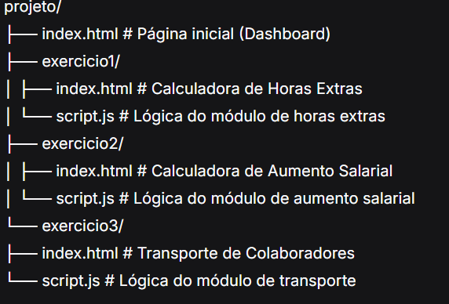

### Curso Técnico de Desenvolvimento de Sistemas - Senai Itapeva
# Sistema Empresarial - Módulos de Gestão

**Descrição:**
O Sistema Empresarial é uma plataforma web composta por três módulos de gestão corporativa desenvolvidos para auxiliar no cálculo de benefícios e custos operacionais. A aplicação oferece ferramentas para cálculo de horas extras, reajuste salarial e custos com transporte fretado, proporcionando uma experiência profissional com interface moderna e responsiva.

## Índice
- [Funcionalidades](#funcionalidades)
- [Tecnologias Utilizadas](#tecnologias-utilizadas)
- [Estrutura do Projeto](#estrutura-do-projeto)
- [Como Utilizar](#como-utilizar)
- [Autores](#autores)
- [Licença](#licença)

## Funcionalidades

### Módulo 1 - Calculadora de Horas Extras
- Cálculo preciso do valor da hora trabalhada baseado em salário mensal (200h mensais)
- Cálculo de horas extras em dias úteis sem adicional
- Cálculo de horas extras em finais de semana com acréscimo de 50%
- Exibição detalhada do valor da hora base e total a receber
- Formatação em moeda brasileira (R$)

### Módulo 2 - Calculadora de Aumento Salarial
- Cálculo automático do percentual de aumento conforme faixas salariais:
  - Até R$ 1.200,00: aumento de 16%
  - R$ 1.200,01 até R$ 2.100,00: aumento de 13%
  - R$ 2.100,01 até R$ 3.000,00: aumento de 10%
  - Acima de R$ 3.000,00: aumento de 5%
- Exibição do salário atual, percentual aplicado, valor do aumento e novo salário

### Módulo 3 - Transporte de Colaboradores
- Tabela de preços regressiva baseada na quantidade de funcionários:
  - 1-49 funcionários: R$ 4,50 por pessoa/dia
  - 50-99 funcionários: R$ 4,10 por pessoa/dia
  - 100-149 funcionários: R$ 3,80 por pessoa/dia
  - 150+ funcionários: R$ 3,60 por pessoa/dia
- Cálculo do custo mensal total considerando funcionários e dias úteis
- Validação de entrada de dados com mensagens de erro apropriadas

### Funcionalidades Gerais
- Dashboard central com cards informativos para navegação entre módulos
- Botão "Limpar Formulário" em cada módulo para reiniciar os campos
- Botão "Voltar para Página Inicial" para facilitar a navegação
- Interface responsiva adaptada para diferentes tamanhos de tela
- Tema escuro profissional com paleta de cores em tons de slate e cinza

## Tecnologias Utilizadas

- **HTML5** - Estrutura semântica das páginas
- **Tailwind CSS (CDN)** - Framework CSS para estilização rápida e responsiva
- **JavaScript (Vanilla)** - Lógica de negócio e manipulação do DOM
- **CSS Custom Properties** - Estilos personalizados para scrollbars e animações

## Estrutura do Projeto

## Como Utilizar

1. Acesse a página inicial (index.html)
2. Escolha um dos três módulos disponíveis clicando nos cards:
   - **Calculadora de Horas Extras**: Informe o salário mensal, horas extras em dias úteis e finais de semana
   - **Calculadora de Aumento Salarial**: Informe o salário atual do funcionário
   - **Transporte de Colaboradores**: Informe a quantidade de funcionários e dias úteis do mês
3. Clique no botão "Calcular" para visualizar o resultado
4. Utilize o botão "Limpar Formulário" para reiniciar os campos
5. Utilize o botão "Voltar para Página Inicial" para retornar ao dashboard

## Autores

- **[Beatriz Sousa de Andrade]** - Desenvolvedor Principal
  - E-mail: beatriz.sandrade.senai@gmail.com

## Licença

Este projeto está licenciado sob a Licença MIT - veja o arquivo LICENSE para mais detalhes.

---
*Desenvolvido como projeto avaliativo para o Curso Técnico de Desenvolvimento de Sistemas - Senai Itapeva*